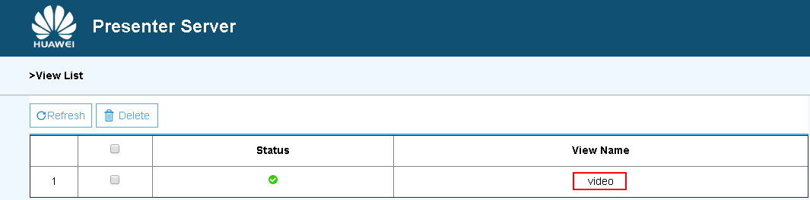

EN|[CN](README_cn.md)

Developers can deploy the application on the Atlas 200 DK to collect camera data in real time and predict facial information in the video.

## Prerequisites<a name="en-us_topic_0167089636_section412314183119"></a>

Before using an open source application, ensure that:

-   MindSpore Studio has been installed.
-   The Atlas 200 DK developer board has been connected to MindSpore Studio, the cross compiler has been installed, the SD card has been prepared, and basic information has been configured. 

## Software Preparation<a name="en-us_topic_0167089636_section177411912193214"></a>

Before running the application, obtain the source code package and configure the environment as follows.

1.  Obtain the source code package.

    Download all the code in the sample-facedetection repository at  [https://github.com/Ascend/sample-facedetection](https://github.com/Ascend/sample-facedetection)  to any directory on Ubuntu Server where MindSpore Studio is located as the MindSpore Studio installation user, for example,  _/home/ascend/sample-facedetection/_.

2.  Log in to Ubuntu Server where MindSpore Studio is located as the MindSpore Studio installation user and set the environment variable  **DDK\_HOME**.

    **vim \~/.bashrc**

    Run the following commands to add the environment variables  **DDK\_HOME**  and  **LD\_LIBRARY\_PATH**  to the last line:

    **export DDK\_HOME=/home/XXX/tools/che/ddk/ddk**

    **export LD\_LIBRARY\_PATH=$DDK\_HOME/uihost/lib**

    > **NOTE:**   
    >-   **XXX**  indicates the MindSpore Studio installation user, and  **/home/XXX/tools**  indicates the default installation path of the DDK.  
    >-   If the environment variables have been added, skip this step.  

    Enter  **:wq!**  to save and exit.

    Run the following command for the environment variable to take effect:

    **source \~/.bashrc**


## Deployment<a name="en-us_topic_0167089636_section15718149133616"></a>

1.  Access the root directory where the face detection application code is located as the MindSpore Studio installation user, for example,  _**/home/ascend/sample-facedetection**_.
2.  Run the deployment script to prepare the project environment, including compiling and deploying the ascenddk public library, downloading the network model, and configuring Presenter Server. The Presenter Server is used to receive the data sent by the application and display the result through the browser.

    **bash deploy.sh** _host\_ip_ **internet**

    -   _host\_ip_: For the Atlas 200 DK developer board, this parameter indicates the IP address of the developer board.


    Example command:

    **bash deploy.sh 192.168.1.2 internet**

    When the message  **Please choose one to show the presenter in browser\(default: 127.0.0.1\):**  is displayed, enter the IP address used for accessing the Presenter Server service in the browser. Generally, the IP address is the IP address for accessing the MindSpore Studio service.

    Select the IP address used by the browser to access the Presenter Server service in  **Current environment valid ip list**, as shown in  [Figure 1](#en-us_topic_0167089636_fig184321447181017).

    **Figure  1**  Project deployment<a name="en-us_topic_0167089636_fig184321447181017"></a>  
    

3.  <a name="en-us_topic_0167089636_li499911453439"></a>Start Presenter Server.

    Run the following command to start the Presenter Server program of the face detection application in the background:

    **python3 presenterserver/presenter\_server.py --app face\_detection &**

    > **NOTE:**   
    >**presenter\_server.py**  is located in the  **presenterserver**  in the current directory. You can run the  **python3 presenter\_server.py -h**  or  **python3 presenter\_server.py --help**  command in this directory to view the usage method of  **presenter\_server.py**.  

    [Figure 2](#en-us_topic_0167089636_fig69531305324)  shows that the presenter\_server service is started successfully.

    **Figure  2**  Starting the Presenter Server process<a name="en-us_topic_0167089636_fig69531305324"></a>  
    

    Use the URL shown in the preceding figure to log in to Presenter Server \( only the Chrome browser is supporte \). The IP address is that entered in  [Figure 3](#en-us_topic_0167089636_fig64391558352)  and the default port number is  **7007**. The following figure indicates that Presenter Server is started successfully.

    **Figure  3**  Home page<a name="en-us_topic_0167089636_fig64391558352"></a>  
    

   
    **Figure 4** Example IP Address <a name="en-us_topic_0167333823_fig64391558353"></a>  
    

    Among them:
    - The IP address of the  Atlas 200 DK developer board is 192.168.1.2 (connected in USB mode).
    - The IP address used by the Presenter Server to communicate with the Atlas 200 DK is in the same network segment as the IP address of the Atlas 200 DK on the UI Host server. For example: 192.168.1.223.
    - The following is an example of accessing the IP address of the Presenter Server using a browser: 10.10.0.1, because the Presenter Server and MindSpore Studio are deployed on the same server, the IP address is also the IP address for accessing the MindSpre Studio through the browser.


## Running<a name="en-us_topic_0167089636_section10271726154420"></a>

1.  Run the face detection application.

    Run the following command in the  **sample-facedetection**  directory to start the face detection application:

    **bash run\_facedetectionapp.sh** _host\_ip_ _presenter\_view\_app\_name camera\_channel\_name_  &

    -   _host\_ip_: For the Atlas 200 DK developer board, this parameter indicates the IP address of the developer board.
    -   _presenter\_view\_app\_name_: Indicates  **View Name**  displayed on the Presenter Server page, which is user-defined. The value of this parameter must be unique on the Presenter Server page.
    -   _camera\_channel\_name_: Indicates the channel to which a camera belongs. The value can be  **Channel-1**  or  **Channel-2**. For details, see  **View the Channel to Which a Camera Belongs** of [Atlas 200 DK User Guide](https://ascend.huawei.com/documentation).

    Example command:

    **bash run\_facedetectionapp.sh 192.168.1.2 video Channel-1 &**

2.  Use the URL that is displayed when you start the Presenter Server service to log in to the Presenter Server website. For details, see  [3](#en-us_topic_0167089636_li499911453439).

    Wait for Presenter Agent to transmit data to the server. Click  **Refresh**. When there is data, the icon in the  **Status**  column for the corresponding channel changes to green, as shown in  [Figure 4](#en-us_topic_0167089636_fig113691556202312).

    **Figure  5**  Presenter Server page<a name="en-us_topic_0167089636_fig113691556202312"></a>  
    

    > **NOTE:**   
    >-   The Presenter Server of the face detection application supports a maximum of 10 channels at the same time , each  presenter\_view\_app\_name  parameter corresponds to a channel.  
    >-   Due to hardware limitations, the maximum frame rate supported by each channel is 20fps,  a lower frame rate is automatically used when the network bandwidth is low.  

3.  Click  **image**  or  **video**  in the  **View Name**  column and view the result. The confidence of the detected face is marked.

## Follow-up Operations<a name="en-us_topic_0167089636_section1092612277429"></a>

-   **Stopping the Face Detection Application**

    The face detection application is running continually after being executed. To stop it, perform the following operation:

    Run the following command in the  _**/home/ascend/sample-facedetection**_  directory as the MindSpore Studio installation user:

    **bash stop\_facedetectionapp.sh** _host\_ip_

    _host\_ip_: For the Atlas 200 DK developer board, this parameter indicates the IP address of the developer board.For the Atlas 300 PCIe card, this parameter indicates the IP address of the PCIe card host.

    Example command:

    **bash stop\_facedetectionapp.sh 192.168.1.2**

-   **Stopping the Presenter Server Service**

    The Presenter Server service is always in the running state after being started. To stop the Presenter Server service of the face detection application, perform the following operations:

    Run the following command to check the process of the Presenter Server service corresponding to the face detection application as the MindSpore Studio installation user:

    **ps -ef | grep presenter | grep face\_detection**

    ```
    ascend@ascend-HP-ProDesk-600-G4-PCI-MT:~/sample-facedetection$ ps -ef | grep presenter | grep face_detection
    ascend    7701  1615  0 14:21 pts/8    00:00:00 python3 presenterserver/presenter_server.py --app face_detection
    ```

    In the preceding information,  _7701_  indicates the process ID of the Presenter Server service corresponding to the face detection application.

    To stop the service, run the following command:

    **kill -9** _7701_

